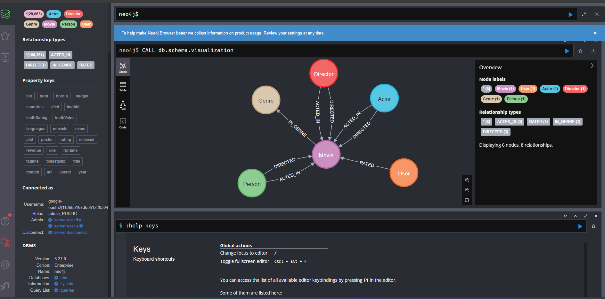
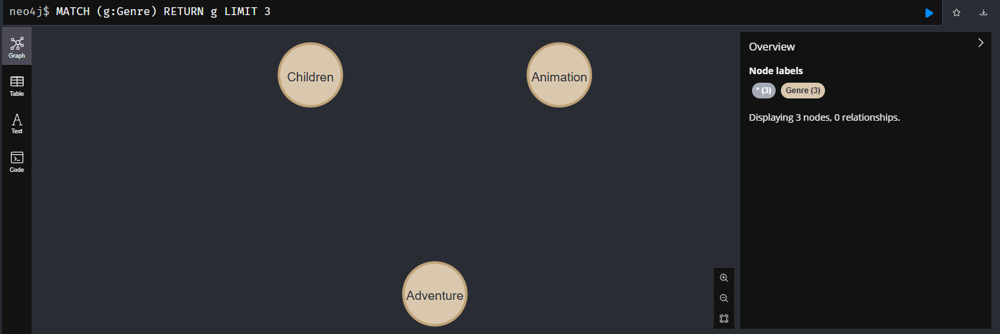
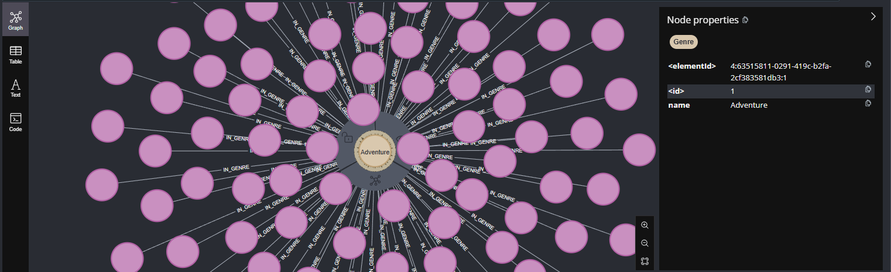
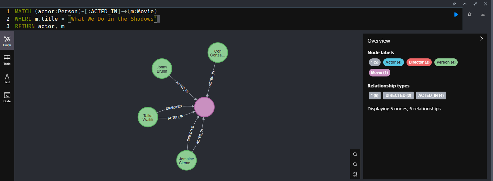
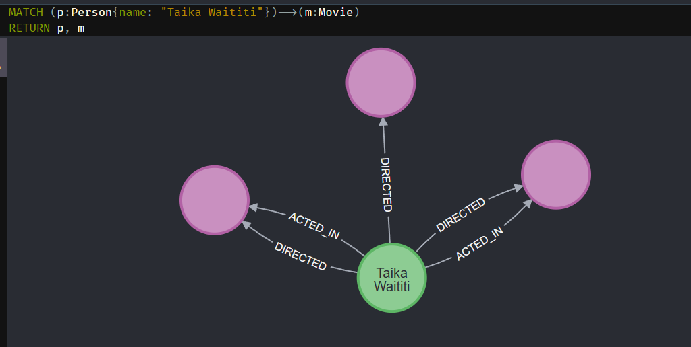

# Knowledge Graphs

## **Graphs** are collections of *nodes* and *relationships*.

**Nodes** are objects, usually labeled to facilitate classification and search.
- Nodes can exist on their own
- They can have relationships to themselves
- Can have multiple labels

**Relationships** represent connections between nodes.
- They have a single direction and type
- Can have only one label


**Properties** are key-value pairs that can be assigned to a node or a relationship.
- They can be booleans, strings, numbers, points(geometric 2D or 3D points, or coordinates), timestamps, lists (of the same data type)
- Can't be nested

## Neo4j and Cypher overview

[**Neo4j**](https://neo4j.com/docs/) is a graph database, useful for data and queries that are extremely large, complex and highly interconnected. 

I will use the [Neo4j Sandbox](https://sandbox.neo4j.com/) to test it.

- **Cypher** is the language we use to query Neo4j. 

In Neo4j the schema is optional, so we can add or change properties as we go.

---

I will create a sandbox database from the Recommendations dataset and explore it.

By calling the schema visualization, I can see the nodes and relationships available.

`CALL db.schema.visualization`



I can see that the schema includes a node called Movies with multiple relationships coming into it, and one going out to Genre.

To search for the first 3 existing genres, I can run:

```SQL
MATCH (g:Genre)
RETURN g
LIMIT 3
```
The `g` here works as an alias.


 
 And when I expand the graph of the nodes, I can see every relationship that specific node has. 



To see all the properties related to the genre, meaning the list of genres included in the database, I can get the values in the *name* property.

```SQL
MATCH (g:Genre)
RETURN g.name
```

This query will return a table with all the available genres.

> To query graphs we use [**ASCII art**](https://en.wikipedia.org/wiki/ASCII_art) to represent nodes and relationships.

To find every movie that has the "Comedy" label in their Genre node, we can query as follows:

```SQL
MATCH (m:Movie)-[:IN_GENRE]->(g:Genre)
-- This first line will look for movies with the IN_GENRE relationship to a Genre node
WHERE g.name = 'Comedy'
-- This will look for Genre nodes that contain the 'Comedy' value to the 'name' property
RETURN m.title
-- And this will return the values from the 'title' property in the 'Movies' nodes 
```
---
If I want to access a specific movie node, and the people who acted in it, I run:


```SQL
MATCH (actor:Person)-[:ACTED_IN]->(m:Movie)
-- Will look for Persons with the ACTED_IN relationship to a Movie node
WHERE m.title = "What We Do in the Shadows"
-- Where the movie title is one chosen from the previous list
RETURN actor, m
-- And this will return the actors and the movie
```

And I get a graph with the central node being the movie and a bunch of nodes that are Persons who acted in it.



The table view will have an actor and a movie column with all the properties related to each Person node and the movie information repeated each time.

To get only a list with the names of the actors, we run the same query but returning only `actor.name`.

---

If I wanted to see which movies Taika Waititi is related to, I can run:

```Python
MATCH (p:Person{name: "Taika Waititi"})-->(m:Movie)
RETURN p, m
```



Showing all the nodes with different relationships, that I could focus on if needed.

---

We can do operations with the data, and select nodes that respond to more than one relationship:

```SQL
MATCH (p:Person{name: "Taika Waititi"})-[:ACTED_IN] ->(m:Movie)<-[r:RATED]-(:User)
-- This will select the ratings of all the movies Taika Waititi acted in
RETURN m.title AS Movie, avg(r.rating) AS avg_rating
-- And this will return the name of each movie and an avarage of the ratings of each movie
```

